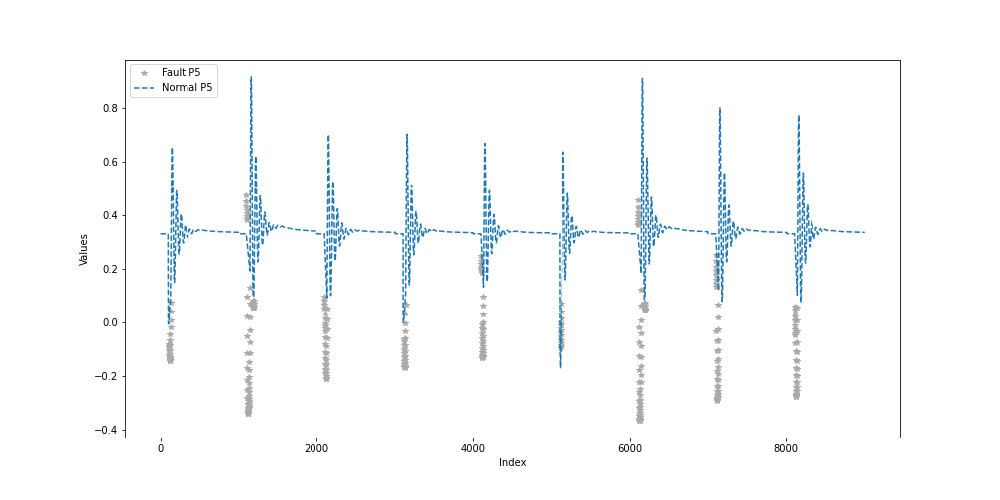
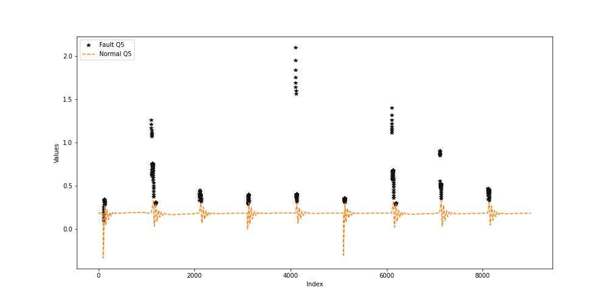

# PowerGrid

### This repo is having the code for fault-detection and classification of the powerGrid simulation data

Below are the graphs for comparision of the values of active power vs reactive power of Bus 5

In the second image one can see that values with labels from KMeans clustering can be seen in different colour, see the legend. Values with label 0 are shown as normal values and with values with label 1 are shown as abnormal values. However, it can be refined.

### Normal vs Abnormal values for P5

### Normal vs Abnormal values for Q5

You can see all the related graphs in the **klustering.ipynb**

