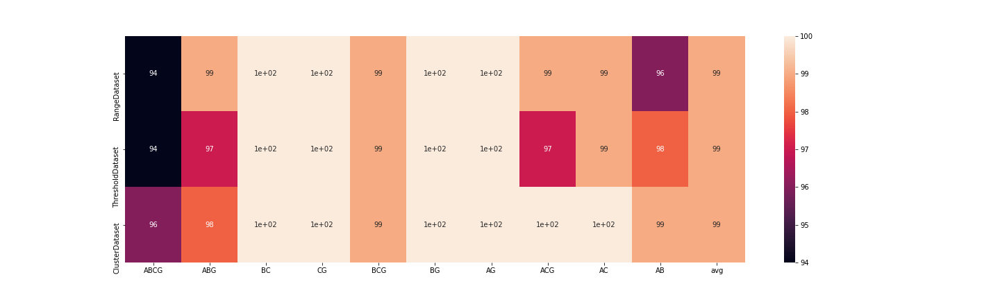
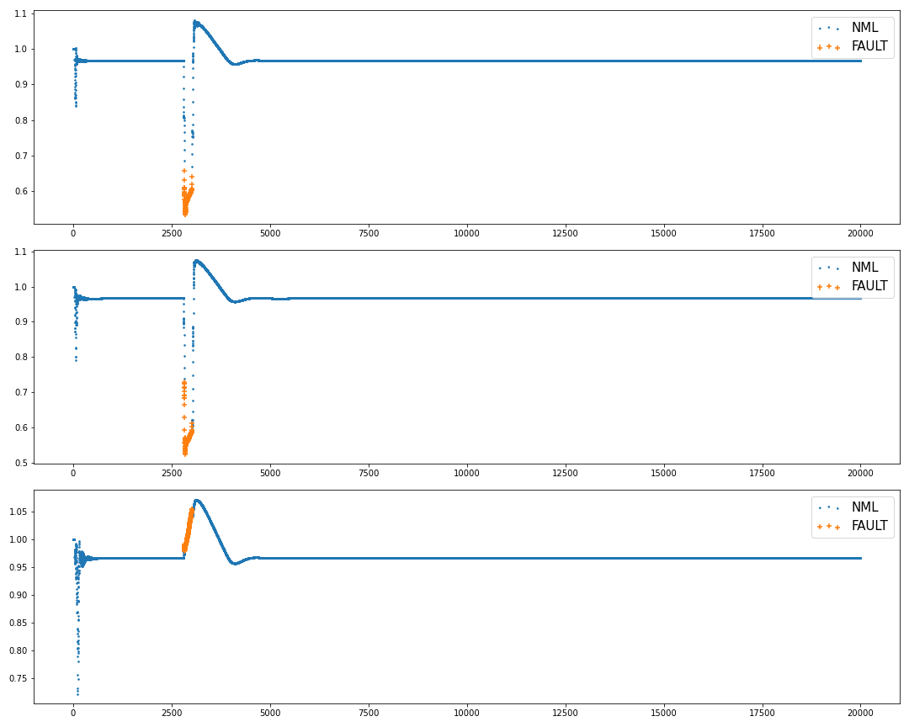
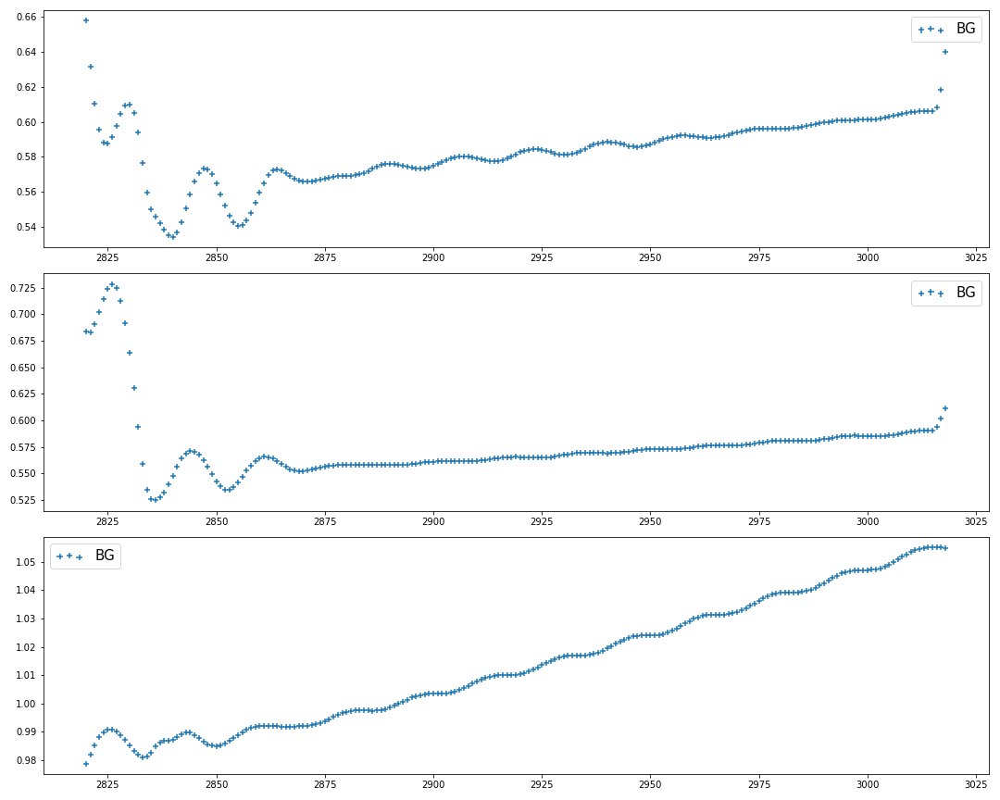
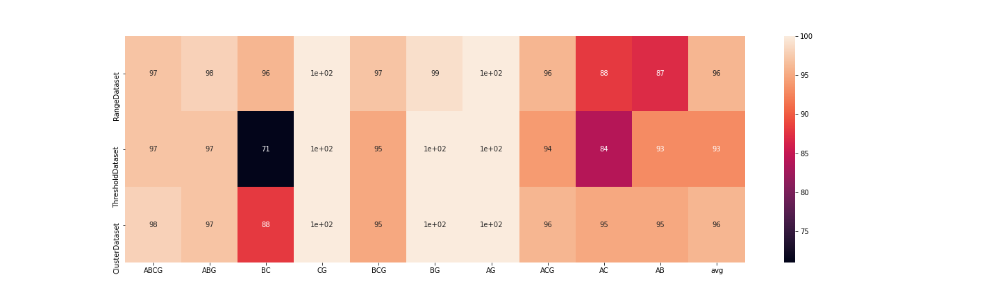

# PowerGrid

### This respository contains files related to 3 Phase AC fault classification implmented using Deep Neural Network.

Whole project can be divided into three parts:

- Data generation from Simulink
- Training the deep neural network
- Validation of the model

Below is the final result of the working model(binary+multi_class): 

This heat map represents accuracy over fault classes + average vs dataset used for validation.

 

# 1 Data generation

**matlab.ipynb** contains code for dataset generation using MatLab/Simulink

Method: 
	For each possible fault, it triggers 10 simulations in simulink.

​	Each simulation has random time-range for fault occurrence.

​	Simulation data is stored as a csv file with name= <number><FaultType>.

Total 3 types of labelling method is used.

1. Labelling by a single threshold
2. Labelling by range of threshold
3. Labelling using KMeans clustering

All the folders containing data has a file **dataset_merge.ipynb** which combines all the simulations data and creates two dataset one for binary classifier and one for multi-class classifier.

# 2 Model training

Deep neural networks with LSTM are implemented for classification task using Tensorflow+Keras. [MC_Classifier_NN.ipynb](https://github.com/YugantM/PowerGrid/blob/main/MC_Classifier_NN.ipynb) containg code for model training and plotting.

Two classifier are trained:

1. Binary classifier to classify the data in two catagories namely 'FAULT' and 'NML'(normal)

2. Multi-class classifier to classify data in ten categories namely 'AB', 'AC', 'BC','AG', 'BG', 'ABG', 'CG', 'ACG', 'BCG', 'ABCG'

   **[A, B, C stands for Phase and G stands for ground]**

Below are the charts showing result on a test file which contains data with Fault-Type BG:

**Detection of fault:**

**Classification of fault type:**

# 3. Validation 

All the datatsets are used to validate the model. Model can detect the fault type with ~99.99% accuracy. The percentage of the accuracy in the charts are point to point validation percentage.

1. Models trained using dataset labelled with range threshold method

2. Models trained using dataset labelled with KMeans method

